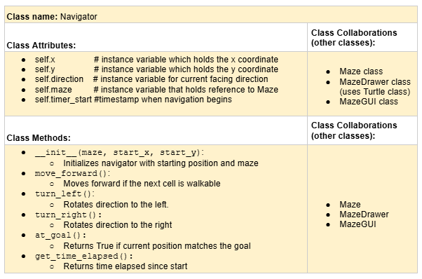
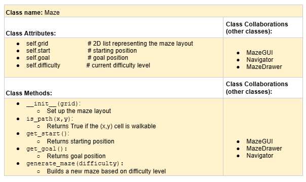
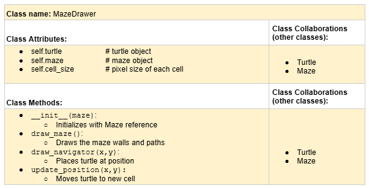
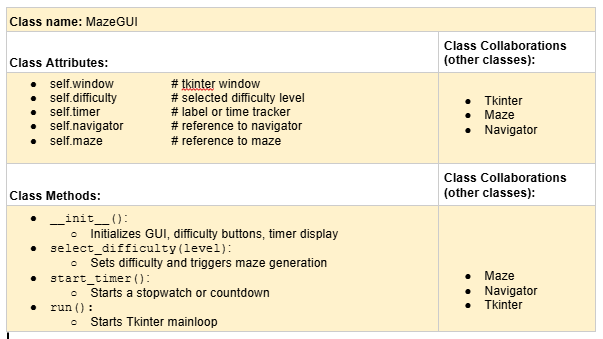

# CSC226 Final Project

## Instructions

**Author(s)**: Iuliia Likhacheva, Arbjosa Halilaj

**Google Doc Link**: https://docs.google.com/document/d/1qB5qFWes-QNh39mKJGSB9EgU-3r2Za-wbCuPmnUEMgg/edit?usp=sharing

---

## Milestone 1: Setup, Planning, Design

**Title**: `Turtle Escape`

**Purpose**: `Generate random mazes (three difficulty levels—Easy, Medium, and Hard) using the Turtle library with the timer and allow the user to solve it interactively using keyboard controls.`

**Source Assignment(s)**: `T02 - exploring Turtles, T03 - Boustrophedon Turtles, T10 - Intro to Classes, T11 - The Legend of Tuna: Breath of Catnip`

**CRC Card(s)**:
  
 

 

 

 


**Branches**:

```
    Branch 1 starting name: p01_final_project_likhachevai
    Branch 2 starting name: p02_final_project_halilaja
```
  
 in place of this one. ")

❗️**Branches**: This project will **require** effective use of git. 

Each partner should create a branch at the beginning of the project, and stay on this branch (or branches of their 
branch) as they work. When you need to bring each others branches together, do so by merging each other's branches 
into your own, following the process we've discussed in previous assignments, then re-branching out from the merged code.  

```
    Branch 1 starting name: p01_final_project_likhachevai
    Branch 2 starting name: p01_final_project_halilaja
```

### References 

https://sites.google.com/site/advancedpythonprogramming/recursion/exploring-a-maze, 
https://www.w3schools.com/python/ref_func_enumerate.asp, 
https://www.tutorialspoint.com/python_data_structure/python_binary_tree.htm, 
https://docs.python.org/3/library/importlib.html, 
https://www.geeksforgeeks.org/python-gui-tkinter/, 
https://docs.python.org/3/library/time.html, 
https://weblog.jamisbuck.org/2011/2/7/maze-generation-algorithm-recap, 
https://www.programiz.com/python-programming/time, 
https://stackoverflow.com/questions/24758326/how-to-resize-a-turtle-screen-window-in-python

---

## Milestone 2: Code Setup and Issue Queue

Most importantly, keep your issue queue up to date, and focus on your code. 🙃

Reflect on what you’ve done so far. How’s it going? Are you feeling behind/ahead? What are you worried about? 
What has surprised you so far? Describe your general feelings. Be honest with yourself; this section is for you, not me.

```
    Everything is going very well right now. The most important thing is that we figured out the structure of our code and have actually started writing it.
    We’ve already created the necessary classes and functions. What surprises us the most is how much simple documentation and planning helped us understand the project better.
    It turned out to be very useful to write CRC cards first and then write code based on them, since you can clearly see which classes, methods, and attributes you need.
    However, we are a bit worried about time—there’s still a lot to do, and we don’t want to rush through the difficult parts at the last minute.
    We also want to make sure that the code we’re writing makes sense and is readable.
```

---

## Milestone 3: Virtual Check-In

Indicate what percentage of the project you have left to complete and how confident you feel. 

**Completion Percentage**: `95%` 

**Confidence**: Describe how confident you feel about completing this project, and why. Then, describe some 
  strategies you can employ to increase the likelihood that you'll be successful in completing this project 
  before the deadline.

```
    We feel confident that the project is mostly complete. Most of the code is finished, and the main features 
    including maze generation for different difficulty levels, keyboard navigation, the timer, pop-up messages,
    and GUI windows are all working well. The overall structure feels stable, and we don't have any major ideas
    left to add at this point.
    
    The only main task remaining is completing and polishing the test suite to make sure the game runs smoothly
    across all levels and that the user experience feels consistent.
    
    At this stage, our biggest focus is making sure everything works as expected and cleaning up any small issues.
    We feel good about the progress we've made and are not worried about running out of time because the game works
    as we have had friends play it and they navigated through it smoothly.
    
    Strategies to finish successfully:
      1. Focus on finishing the test suite and make sure it covers the main functions and edge cases.
      2. Do a final round of testing together and check how the game runs from start to finish.
      3. Make sure the code is well-commented and easy to read.
      4. Check for any last small bugs, especially in movement logic, timer updates, and pop-up behavior.
```

---

## Milestone 4: Final Code, Presentation, Demo

### User Instructions

In a paragraph, explain how to use your program. Assume the user is starting just after they hit the "Run" button 
in PyCharm. 
```
  After clicking "Run" in PyCharm, a window will appear welcoming the user to Turtle Escape game. The user should click the "Start Game" button to continue. 
Then, an instructions window will pop up, explaining the game’s goal and how to use the arrow keys to control the turtle. 
After reading the instructions, the user can click the "Got it! Let's Play!" button.
Another small window will recommend maximizing the screen for a better experience — press "OK" to dismiss it.
  Next, the user will be asked to choose a difficulty (Easy, Medium, or Hard) by clicking one of the buttons. 
After choosing, a new window confirms user's selection.
Finally, the maze will appear, and the turtle will be ready at the starting point. The user can use the arrow keys to move: '↑' to move up, '↓' to move down, '>' to move forward, '<' to move backward.
As the turtle moves, a timer starts automatically. The goal is to reach the red square as fast as possible without hitting walls (black squares). 
When the turtle reach the goal, a popup will show the user's final time and ask if they want to play again or exit.


```

### Errors and Constraints

Every program has bugs or features that had to be scrapped for time. These bugs should be tracked in the issue queue. 
You should already have a few items in here from the prior weeks. Create a new issue for any undocumented errors and 
deficiencies that remain in your code. Bugs found that aren't acknowledged in the queue will be penalized.

```
  Our game contains some bugs that will require additional attention and development in the future.
  
  1. Multiple Tk() windows created improperly:
     Every popup window (welcome, instructions, maximize tip, end popup) is created using tk.Tk().
     
  2. Turtle window sometimes stays open after exit:
     When exiting the game from the popup after completing the maze, the Turtle graphics window sometimes
     stayed open instead of closing cleanly when we initally started testing the code. 
     
  3. Sometimes some tests in the test suite fail:
     The test suite was helpful for checking core logic during development, but occasionally tests fail 
     due to edge cases or maze configuration differences. These issues are not fully debugged and would 
     need more consistent grid setups or mock data to resolve reliably.
     
  4. Grid redraw is not optimized:
     The entire maze is redrawn using `turtle.clearscreen()` every time the game restarts. While this is 
     acceptable for small grids, it can cause flickering or lag for larger ones (e.g., "Hard" level).

  5. Timer doesn't pause on invalid moves:
     If a player keeps hitting walls, the timer continues running even though no real progress is made.
     While technically this isn't a bug, it could be considered an unfair penalty and worth revisiting if
     we decide to refine how time scoring works.
```

### Peer Evaluation

It is important that all members of your team contribute equitably. The peer evaluation is your chance to either 
a) celebrate the great work you all did together as an effective team, or b) indicate to the instructor if a member of
your team did not contribute their fair share. Grades will be adjusted for any team member who is evaluated poorly. Your
commit history will be used as evidence, so make sure you are using git effectively!

### Reflection

Each partner should write three to four well-written paragraphs address the following (at a minimum):
- Why did you select the project that you did?
- How closely did your final project reflect your initial design?
- What did you learn from this process?
- What was the hardest part of the final project?
- What would you do differently next time, knowing what you know now?
- How well did you work with your partner? What made it go well? What made it challenging?

```
    Partner 1: Iuliia Likhacheva
    
    We decided to create the maze Turtle game project because we wanted to combine the technical skills we learned in class with the opportunity to be creative.
  We liked the idea of making a game where the user could control a turtle, move through a maze, and solve it. This project also gave us a chance to apply what we had studied, 
  like using classes, writing functions and methods, working with Turtle graphics, and using Tkinter to create a graphical user interface.

    Our final project turned out quite similar to what we originally planned. At first, we just wanted to build a simple maze and a player that could move through it. 
  But as we worked on it, we added more interesting features like a timer, different difficulty levels, and a restart button. Some ideas we had at the beginning, 
  like adding sound effects, didn’t make it into the final version because we ran out of time. Still, the main idea and the way the game plays stayed the same.

    We learned a lot during this project. We realized how important planning is, but also how important it is to stay flexible when new problems come up. 
  We got much better at debugging and thinking about how different parts of the program connect with each other. The hardest part was making sure everything reset correctly 
  when the player wanted to start a new game — it took a lot of testing and fixing small mistakes.

    We worked really well together as partners. We divided the work fairly and helped each other when needed, also each partner was responsible for several subtasks in the issue queue. 
  It helped that we communicated a lot and regularly reviewed each other’s code. The only real challenge was that our coding styles were sometimes a little different, but we handled it well 
  by being patient and keeping the project organized. Overall, it was a great team effort!


```

```
    Partner 2: Arbjosa Halilaj
    
  We chose the maze Turtle game project because it allowed us to blend creativity with core programming skills we learned in class. From 
  From the start, I was excited about building something interactive and visual. The idea of designing a maze that users could solve with
  keyboard controls seemed like a fun challenge and a great way to apply our understanding of object-oriented design, Turtle graphics, and
  GUI development with Tkinter. We also liked that it would be visually engaging for a final demo.
  Our final version matched our initial plan in most ways, though it grew more complex as we built it. We started with a simple concept,
  generate a maze and let the turtle move through it, but we gradually added more features like the timer, goal marker, play again functionality,
  and difficulty levels. While we didn't manage to add every feature we originally brainstormed, like music or a scoring system, the 
  essential gameplay and user experience turned out how we imagined. We also stayed true to our top-down design approach and followed our
  CRC cards and task breakdown closely.
  This project helped me understand how big programs come together from smaller components. I learned how useful classes are for organizing
  code, and I also practiced breaking down large problems into manageable parts. One of the most difficult parts was coordinating the
  Turtle window with the Tkinter interface and making sure the maze reset cleanly without leftover graphics or bugs. We had to troubleshoot
  a lot, but those moments helped me improve my debugging and testing skills.
  Working with my partner went really well. We both contributed equally and stayed on top of our tasks. What helped the most was our
  communication, we used an issue tracker to divide up the work and kept each other updated. I appreciated that we were both open to
  feedback and took time to help each other solve problems. Sometimes our coding habits or naming styles differed, but we found common
  ground by reviewing and adjusting our code together. I'm proud of how we collaborated and finished a polished, playable game!
```